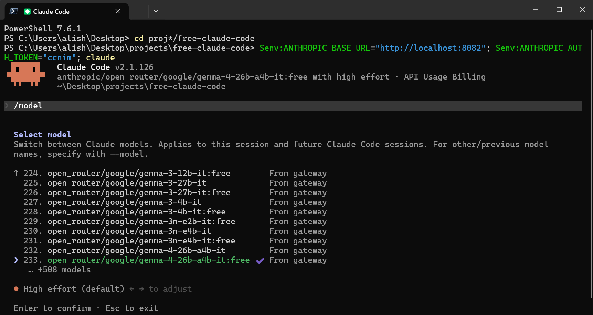
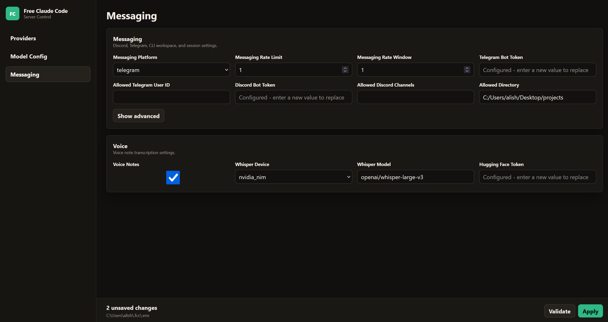

<div align="center">

# Free Claude Code

An Anthropic-compatible proxy that lets Claude Code, the VS Code extension, JetBrains ACP, and chat bots route traffic through alternative model providers.

[](https://opensource.org/licenses/MIT)
[](https://www.python.org/downloads/)
[](https://github.com/astral-sh/uv)
[](https://github.com/Pushpenderrathore/claude-code/actions/workflows/tests.yml)
[](https://pypi.org/project/ty/)
[](https://github.com/astral-sh/ruff)
[](https://github.com/Delgan/loguru)

Free Claude Code forwards Anthropic Messages API traffic from Claude Code to a configurable set of upstream providers, including NVIDIA NIM, Kimi, Wafer, OpenRouter, DeepSeek, LM Studio, llama.cpp, Ollama, OpenCode Zen, and Z.ai. The client-side protocol that Claude Code expects remains stable, while the operator retains full control over which model — free, paid, or local — handles each request.

[Quick Start](#quick-start) · [Providers](#choose-a-provider) · [Clients](#connect-claude-code) · [Integrations](#optional-integrations) · [Development](#development)

</div>

<div align="center">
  
</div>

## Overview

Free Claude Code provides:

- A drop-in proxy for the Anthropic API calls issued by Claude Code.
- Ten provider backends: NVIDIA NIM, Kimi, Wafer, OpenRouter, DeepSeek, LM Studio, llama.cpp, Ollama, OpenCode Zen, and Z.ai.
- Per-tier model routing, enabling Opus, Sonnet, Haiku, and fallback traffic to be directed to different providers.
- Native support for the Claude Code `/model` picker via the proxy's `/v1/models` endpoint. Claude Code must opt in to Gateway model discovery; see [Model Picker](#model-picker).
- Streaming, tool use, reasoning and thinking block handling, and local request optimizations.
- An optional Discord or Telegram bot wrapper for remote coding sessions.
- Optional usage through the VS Code extension.
- Optional voice-note transcription via local Whisper or NVIDIA NIM.
- A local administrative interface at `/admin` for editing supported proxy settings, validating changes, and verifying providers. Access is restricted to loopback.

## Table of Contents

<details open>
<summary>Click to expand or collapse</summary>

- [Overview](#overview)
- [Quick Start](#quick-start)
  - [1–2 & 4. Automated Install (recommended)](#12--4-automated-install-recommended)
  - [1. Install Claude Code (manual alternative)](#1-install-claude-code-manual-alternative)
  - [2. Install Runtime Requirements (manual alternative)](#2-install-runtime-requirements-manual-alternative)
  - [3. Obtain an NVIDIA NIM API Key](#3-obtain-an-nvidia-nim-api-key)
  - [4. Install the Proxy (manual alternative)](#4-install-the-proxy-manual-alternative)
  - [5. Start the Proxy](#5-start-the-proxy)
  - [6. Open the Admin UI and Configure NVIDIA NIM](#6-open-the-admin-ui-and-configure-nvidia-nim)
  - [7. Launch Claude Code](#7-launch-claude-code)
- [Installation Troubleshooting](#installation-troubleshooting)
  - [1. `uv` command not found after install](#1-zsh-command-not-found-uv-immediately-after-installing-uv)
  - [2. `uv -version` returns "unexpected argument"](#2-uv--version-returns-unexpected-argument)
  - [3. Uvicorn cannot import module `service`](#3-error-error-loading-asgi-app-could-not-import-module-service)
  - [4. `cd` into clone target fails](#4-cd-no-such-file-or-directory-nvidia-nim-after-cloning)
  - [5. `.env` file does not appear after copy](#5-env-file-does-not-appear-after-cp-envexample-env)
  - [6. Clone target already exists](#6-fatal-destination-path-nvidia-nim-already-exists-and-is-not-an-empty-directory)
  - [7. Port 8082 is already in use](#7-port-8082-is-already-in-use)
- [Uninstall](#uninstall)
  - [Automated Uninstall](#automated-uninstall)
  - [Manual Uninstall](#manual-uninstall)
- [Choose a Provider](#choose-a-provider)
  - [1. NVIDIA NIM](#1-nvidia-nim)
  - [2. Kimi](#2-kimi)
  - [3. Wafer](#3-wafer)
  - [4. OpenRouter](#4-openrouter)
  - [5. DeepSeek](#5-deepseek)
  - [6. LM Studio](#6-lm-studio)
  - [7. llama.cpp](#7-llamacpp)
  - [8. Ollama](#8-ollama)
  - [9. OpenCode Zen](#9-opencode-zen)
  - [10. Z.ai](#10-zai)
  - [11. Mixing Providers by Model Tier](#11-mixing-providers-by-model-tier)
- [Connect Claude Code](#connect-claude-code)
  - [1. Claude Code CLI](#1-claude-code-cli)
  - [2. VS Code Extension](#2-vs-code-extension)
  - [3. JetBrains ACP](#3-jetbrains-acp)
  - [4. Model Picker](#4-model-picker)
- [Optional Integrations](#optional-integrations)
  - [1. Discord and Telegram Bots](#1-discord-and-telegram-bots)
  - [2. Voice Notes](#2-voice-notes)
- [Architecture](#architecture)
- [Development](#development)
  - [1. Project Structure](#1-project-structure)
  - [2. Running From Source](#2-running-from-source)
  - [3. Standard Commands](#3-standard-commands)
  - [4. Package Scripts](#4-package-scripts)
  - [5. Extending the Proxy](#5-extending-the-proxy)
- [Walkthrough](#walkthrough)
  - [1. All Links](#1-all-links)
  - [2. Quick Commands](#2-quick-commands)
  - [3. Step-by-Step Guide](#3-step-by-step-guide)
- [Contributing](#contributing)
- [License](#license)

</details>

## Quick Start

The repository ships one-shot installers that perform steps 1, 2, and 4 below (Node.js + Claude Code CLI, uv + Python 3.14, and the proxy itself). Step 3 — obtaining the NVIDIA NIM API key — remains manual.

### 1–2 & 4. Automated Install (recommended)

Clone the repository first, then run the script for your platform. Both scripts are idempotent and re-run safe (they upgrade in place).

**macOS and Linux:**

```bash
git clone https://github.com/Pushpenderrathore/claude-code.git
cd claude-code
chmod +x install.sh
./install.sh
```

**Windows PowerShell:**

```powershell
git clone https://github.com/Pushpenderrathore/claude-code.git
cd claude-code
powershell -ExecutionPolicy Bypass -File .\install.ps1
```

The script will:

1. Install Node.js + npm (via `brew` / `apt` / `dnf` / `pacman` on Unix, or `winget` / `choco` on Windows) if missing.
2. Install the Claude Code CLI (`npm i -g @anthropic-ai/claude-code`).
3. Install or update [uv](https://docs.astral.sh/uv/), then install Python 3.14.
4. Install the proxy (`fcc-server`, `fcc-claude`, `fcc-init`) as a uv tool.

Skip ahead to [3. Obtain an NVIDIA NIM API Key](#3-obtain-an-nvidia-nim-api-key) once the script finishes.

### 1. Install Claude Code (manual alternative)

If you prefer to do it step by step, install the latest release of [Claude Code](https://code.claude.com/docs/en/overview):

```bash
npm install -g @anthropic-ai/claude-code
```

### 2. Install Runtime Requirements (manual alternative)

Install the latest version of [uv](https://docs.astral.sh/uv/getting-started/installation/) along with Python 3.14.

macOS and Linux:

```bash
curl -LsSf https://astral.sh/uv/install.sh | sh
uv self update
uv python install 3.14
```

Windows PowerShell:

```powershell
powershell -ExecutionPolicy ByPass -c "irm https://astral.sh/uv/install.ps1 | iex"
uv self update
uv python install 3.14
```

### 3. Obtain an NVIDIA NIM API Key

Create a free NVIDIA NIM API key and keep it available for the Admin UI configuration step. See [NVIDIA NIM provider setup](#nvidia-nim-provider) for details.

### 4. Install the Proxy (manual alternative)

```bash
uv tool install --force git+https://github.com/Pushpenderrathore/claude-code.git
```

The same command is used to update an existing installation.

### 5. Start the Proxy

```bash
fcc-server
```

After startup, Uvicorn prints the proxy bind address and the application logs the administrative URL:

```text
INFO:     Admin UI: http://127.0.0.1:8082/admin (local-only)
```

Most terminals render this URL as a clickable link. Substitute the value of `PORT` if it differs from `8082`.

### 6. Open the Admin UI and Configure NVIDIA NIM

Open the Admin UI URL printed in the terminal.

<div align="center">
  
</div>

Paste the NVIDIA NIM API key into `NVIDIA_NIM_API_KEY`, click **Validate**, and then click **Apply**.

The default model is preset to `nvidia_nim/z-ai/glm4.7`. This may be changed at any time through the same Admin UI.

### 7. Launch Claude Code

```bash
fcc-claude
```

`fcc-claude` reads the currently configured port and authentication token on each invocation, sets the required Claude Code environment variables (including a 190,000-token `CLAUDE_CODE_AUTO_COMPACT_WINDOW` value for auto-compaction), and then launches the underlying `claude` command.

## Installation Troubleshooting

The following issues are commonly encountered while completing the [Quick Start](#quick-start). Each entry pairs a symptom with the resolution.

### 1. `zsh: command not found: uv` immediately after installing uv

The `uv` installer places the binary in `$HOME/.local/bin`, but the current shell session does not yet include that directory in `PATH`. The installer prints this on completion; if it has scrolled out of view, apply the fix below.

macOS and Linux (bash or zsh):

```bash
source $HOME/.local/bin/env
uv --version
```

After verifying that `uv --version` succeeds, continue with `uv python install 3.14`.

To make the change permanent for new shell sessions, append the same `source` line to the appropriate shell rc file:

```bash
# zsh (default on macOS)
echo 'source $HOME/.local/bin/env' >> ~/.zshrc
source ~/.zshrc

# bash
echo 'source $HOME/.local/bin/env' >> ~/.bashrc
source ~/.bashrc

# fish
echo 'source $HOME/.local/bin/env.fish' >> ~/.config/fish/config.fish
```

On Windows PowerShell, close and reopen the terminal after the installer completes, or run `refreshenv` if the [Chocolatey](https://chocolatey.org/) helpers are available.

### 2. `uv -version` returns "unexpected argument"

`uv` uses the GNU-style long flag. Use `uv --version` (two dashes) or `uv self version`.

### 3. `ERROR: Error loading ASGI app. Could not import module "service"`

The Uvicorn entry point is `server:app`, not `service:app` or `app:app`. From a source checkout:

```bash
uv run uvicorn server:app --host 0.0.0.0 --port 8082
```

Most users do not need this command — install the packaged proxy and run `fcc-server` as described in [Quick Start](#quick-start) instead. Use the `uvicorn` form only when working from a local clone of the repository.

### 4. `cd: no such file or directory: nvidia-nim` after cloning

The directory is only named `nvidia-nim` when the repository is cloned with that name as the target. Either clone with an explicit target directory, or `cd` into the default `claude-code` directory produced by `git clone`:

```bash
# Option A — clone into an explicitly named directory
git clone https://github.com/Pushpenderrathore/claude-code.git nvidia-nim
cd nvidia-nim

# Option B — use the default directory name
git clone https://github.com/Pushpenderrathore/claude-code.git
cd claude-code
```

### 5. `.env` file does not appear after `cp .env.example .env`

The file is created successfully; macOS Finder and `ls` hide dotfiles by default. Confirm with `ls -la` or open the file directly:

```bash
ls -la .env
open -e .env        # macOS, opens in TextEdit
```

### 6. `fatal: destination path 'nvidia-nim' already exists and is not an empty directory`

`git clone` refuses to overwrite a non-empty target. Remove or rename the existing directory if its contents are not needed, or clone into a different target name:

```bash
rm -rf nvidia-nim   # destructive — verify contents first
git clone https://github.com/Pushpenderrathore/claude-code.git nvidia-nim
```

### 7. Port 8082 is already in use

Stop any previously started instance of `fcc-server` (or any other process bound to the port), or choose a different port:

```bash
lsof -i :8082       # identify the process holding the port (macOS / Linux)
fcc-server --port 8090
```

When changing the port, update `ANTHROPIC_BASE_URL` for any connected client (Claude Code CLI, VS Code, JetBrains ACP) to match.

## Uninstall

The repository ships matching uninstall scripts that mirror the installers. By default they remove **only the proxy** (the thing this repository installs). Shared toolchain (Node.js, npm, uv, uv-managed Pythons) is intentionally left in place — uninstall those manually if you also want them gone.

### Automated Uninstall

**macOS and Linux:**

```bash
chmod +x Uninstall.sh
./Uninstall.sh                     # remove the proxy only
./Uninstall.sh --with-claude-cli   # also npm-uninstall @anthropic-ai/claude-code
./Uninstall.sh --purge             # also delete ~/.fcc/ (API keys, managed .env, logs)
./Uninstall.sh --all               # shorthand for --with-claude-cli --purge
```

**Windows PowerShell:**

```powershell
powershell -ExecutionPolicy Bypass -File .\Uninstall.ps1                  # proxy only
powershell -ExecutionPolicy Bypass -File .\Uninstall.ps1 -WithClaudeCli   # also npm-uninstall the CLI
powershell -ExecutionPolicy Bypass -File .\Uninstall.ps1 -Purge           # also delete %USERPROFILE%\.fcc
powershell -ExecutionPolicy Bypass -File .\Uninstall.ps1 -All             # shorthand for both
```

Each step is idempotent: if a component is already gone, the script reports it and continues.

> **Note:** `--purge` / `-Purge` deletes `~/.fcc/`, which contains your `NVIDIA_NIM_API_KEY` (and any other provider keys), the managed `.env`, and proxy logs. Back the directory up first if you intend to reinstall later.

### Manual Uninstall

The automated scripts run these commands under the hood. Run them yourself if you want fine-grained control.

```bash
# 1. Remove the proxy (fcc-server, fcc-claude, fcc-init, claude-code shim)
uv tool uninstall claude-code

# 2. (Optional) Remove the Claude Code CLI
npm uninstall -g @anthropic-ai/claude-code

# 3. (Optional, destructive) Remove user config — contains API keys
rm -rf ~/.fcc        # macOS / Linux
# Remove-Item -LiteralPath "$env:USERPROFILE\.fcc" -Recurse -Force   # Windows PowerShell

# 4. (Optional) Remove shared toolchain — only do this if no other project needs it
uv self uninstall                # remove uv itself
uv python uninstall 3.14         # remove the uv-managed Python (run before uv self uninstall)
```

## Choose a Provider

Select a provider, supply its API key or local URL through the Admin UI, and set `MODEL` to a provider-prefixed model slug. `MODEL` acts as the fallback. The values `MODEL_OPUS`, `MODEL_SONNET`, and `MODEL_HAIKU` may be used to override routing for individual Claude Code model tiers.

<a id="nvidia-nim-provider"></a>

### 1. [NVIDIA NIM](https://build.nvidia.com/)

Obtain an API key at [build.nvidia.com/settings/api-keys](https://build.nvidia.com/settings/api-keys).

In the Admin UI, paste the key into `NVIDIA_NIM_API_KEY`. The default value of `MODEL` is `nvidia_nim/z-ai/glm4.7`.

Common examples:

- `nvidia_nim/z-ai/glm4.7`
- `nvidia_nim/z-ai/glm5`
- `nvidia_nim/moonshotai/kimi-k2.5`
- `nvidia_nim/minimaxai/minimax-m2.5`

Available models can be browsed at [build.nvidia.com](https://build.nvidia.com/explore/discover).

### 2. [Kimi](https://platform.moonshot.ai/)

Obtain an API key at [platform.moonshot.ai/console/api-keys](https://platform.moonshot.ai/console/api-keys).

In the Admin UI, paste the key into `KIMI_API_KEY` and set `MODEL` to a Kimi slug, such as `kimi/kimi-k2.5`.

Available models can be browsed at [platform.moonshot.ai](https://platform.moonshot.ai).

### 3. [Wafer](https://wafer.ai/)

Obtain an API key from [wafer.ai](https://wafer.ai). In the Admin UI, paste the key into `WAFER_API_KEY` and set `MODEL` to a Wafer Pass model, such as `wafer/DeepSeek-V4-Pro`.

Common examples:

- `wafer/DeepSeek-V4-Pro`
- `wafer/MiniMax-M2.7`
- `wafer/Qwen3.5-397B-A17B`
- `wafer/GLM-5.1`

This provider connects to Wafer's Anthropic-compatible endpoint at `https://pass.wafer.ai/v1/messages`.

### 4. [OpenRouter](https://openrouter.ai/)

Obtain an API key at [openrouter.ai/keys](https://openrouter.ai/keys).

In the Admin UI, paste the key into `OPENROUTER_API_KEY` and set `MODEL` to an OpenRouter slug, such as `open_router/stepfun/step-3.5-flash:free`.

Browse [all models](https://openrouter.ai/models) or the [free models](https://openrouter.ai/collections/free-models) collection.

### 5. [DeepSeek](https://platform.deepseek.com/)

Obtain an API key at [platform.deepseek.com/api_keys](https://platform.deepseek.com/api_keys).

In the Admin UI, paste the key into `DEEPSEEK_API_KEY` and set `MODEL` to a DeepSeek slug, such as `deepseek/deepseek-chat`.

This provider connects to DeepSeek's Anthropic-compatible endpoint rather than the OpenAI chat-completions endpoint.

### 6. [LM Studio](https://lmstudio.ai/)

Start the LM Studio local server and load a model. In the Admin UI, retain or update `LM_STUDIO_BASE_URL`, then set `MODEL` to the model identifier shown by LM Studio, prefixed with `lmstudio/`.

Models with tool-use support are preferred for Claude Code workflows.

### 7. [llama.cpp](https://github.com/ggml-org/llama.cpp)

Start `llama-server` with an Anthropic-compatible `/v1/messages` endpoint and sufficient context to handle Claude Code requests.

In the Admin UI, retain or update `LLAMACPP_BASE_URL`, then set `MODEL` to the local model slug, prefixed with `llamacpp/`.

Context size is significant for local coding models. If llama.cpp returns HTTP 400 for ordinary Claude Code requests, increase `--ctx-size` and confirm that the selected model and server build support the required features.

### 8. [Ollama](https://ollama.com/)

Run Ollama and pull a model:

```bash
ollama pull llama3.1
ollama serve
```

In the Admin UI, retain or update `OLLAMA_BASE_URL`, then set `MODEL` to the tag reported by `ollama list`, prefixed with `ollama/`.

`OLLAMA_BASE_URL` is the Ollama server root and should not include a `/v1` suffix. Examples of model slugs include `ollama/llama3.1` and `ollama/llama3.1:8b`.

### 9. [OpenCode Zen](https://opencode.ai/)

Obtain an API key at [opencode.ai/auth](https://opencode.ai/auth).

In the Admin UI, paste the key into `OPENCODE_API_KEY` and set `MODEL` to an OpenCode Zen model slug, such as `opencode/gpt-5.3-codex`.

OpenCode Zen is a curated model gateway that provides access to models from Anthropic, OpenAI, Google, DeepSeek, and others through a single API key and an OpenAI-compatible endpoint at `https://opencode.ai/zen/v1`.

Common examples:

- `opencode/gpt-5.3-codex`
- `opencode/claude-sonnet-4`
- `opencode/deepseek-v4-flash-free` (free)
- `opencode/gemini-3-flash`
- `opencode/big-pickle` (free)
- `opencode/glm-5.1`

Available models can be browsed at [opencode.ai](https://opencode.ai).

### 10. [Z.ai](https://z.ai/)

Obtain an API key at [Z.ai/manage-apikey/apikey-list](https://z.ai/manage-apikey/apikey-list).

In the Admin UI, paste the key into `ZAI_API_KEY` and set `MODEL` to a Z.ai model slug, such as `zai/glm-5.1`.

Z.ai exposes GLM models through the OpenAI-compatible Coding Plan endpoint at `https://api.z.ai/api/coding/paas/v4`.

Common examples:

- `zai/glm-5.1`
- `zai/glm-5-turbo`

Available models can be browsed at [Z.ai](https://z.ai).

### 11. Mixing Providers by Model Tier

Each model tier may use a distinct provider by configuring `MODEL_OPUS`, `MODEL_SONNET`, and `MODEL_HAIKU` in the Admin UI. Any tier left blank inherits the value of `MODEL`.

For example, Opus may be routed to `nvidia_nim/moonshotai/kimi-k2.5`, Sonnet to `open_router/deepseek/deepseek-r1-0528:free`, Haiku to `lmstudio/unsloth/GLM-4.7-Flash-GGUF`, while the fallback `MODEL` remains `zai/glm-5.1`.

## Connect Claude Code

### 1. Claude Code CLI

For terminal usage, the installed launcher is recommended:

```bash
fcc-claude
```

`fcc-server` must remain running during use. The Admin UI manages proxy configuration and restarts the server when runtime settings change. `fcc-claude` reads the current Admin UI-managed port and authentication token on each invocation and sets `CLAUDE_CODE_AUTO_COMPACT_WINDOW` to `190000` to enable auto-compaction.

### 2. VS Code Extension

Open Settings, search for `claude-code.environmentVariables`, choose **Edit in settings.json**, and add the following:

```json
"claudeCode.environmentVariables": [
  { "name": "ANTHROPIC_BASE_URL", "value": "http://localhost:8082" },
  { "name": "ANTHROPIC_AUTH_TOKEN", "value": "freecc" },
  { "name": "CLAUDE_CODE_ENABLE_GATEWAY_MODEL_DISCOVERY", "value": "1" },
  { "name": "CLAUDE_CODE_AUTO_COMPACT_WINDOW", "value": "190000" }
]
```

Reload the extension. If the extension presents a login screen, complete the Anthropic Console path once; the local proxy will continue to handle model traffic after the environment variables take effect.

### 3. JetBrains ACP

Edit the installed Claude ACP configuration:

- Windows: `C:\Users\%USERNAME%\AppData\Roaming\JetBrains\acp-agents\installed.json`
- Linux and macOS: `~/.jetbrains/acp.json`

Set the environment block for `acp.registry.claude-acp`:

```json
"env": {
  "ANTHROPIC_BASE_URL": "http://localhost:8082",
  "ANTHROPIC_AUTH_TOKEN": "freecc",
  "CLAUDE_CODE_ENABLE_GATEWAY_MODEL_DISCOVERY": "1",
  "CLAUDE_CODE_AUTO_COMPACT_WINDOW": "190000"
}
```

Restart the IDE after modifying the file.

### 4. Model Picker

<div align="center">
  
</div>

## Optional Integrations

For all integrations described below, managed proxy settings should be modified exclusively through the Admin UI at `/admin`: edit the relevant fields, click **Validate**, and then click **Apply**. The footer indicates where the managed configuration is stored. Manual editing of that file is intentionally not documented here.

### 1. Discord and Telegram Bots

The bot wrapper executes Claude Code sessions remotely, streams progress, supports reply-based conversation branches, and provides controls for stopping or clearing tasks.

**Discord**

1. Create a bot in the [Discord Developer Portal](https://discord.com/developers/applications).
2. Enable the **Message Content Intent**.
3. Invite the bot with read, send, and message-history permissions.
4. Record the bot token and the numeric identifier of each channel in which the bot should respond.

**Telegram**

1. Create a bot through [@BotFather](https://t.me/BotFather) and record the bot token.
2. Retrieve the numeric user ID from [@userinfobot](https://t.me/userinfobot) so that access can be restricted to a single user.

**Admin UI Configuration**

1. With `fcc-server` running, open the Admin UI URL from the terminal output.
2. In the sidebar, select **Messaging**.
3. Set **Messaging Platform** to either **discord** or **telegram**.
4. For Discord, paste the **Discord Bot Token** and **Allowed Discord Channels**. For Telegram, paste the **Telegram Bot Token** and **Allowed Telegram User ID**.
5. Set **Allowed Directory** to an absolute path on the host running the proxy — the workspace root the bot is permitted to use.
6. Click **Validate**, then **Apply**. Restart the server if prompted.

<div align="center">
  
</div>

<p align="center"><em>Admin UI — Messaging view (platform, bots, and voice)</em></p>

**Commands**

- `/stop` cancels a task. Replying to a task message limits the cancellation to that branch.
- `/clear` resets sessions. Replying to a message limits the reset to that branch.
- `/stats` displays session state.

### 2. Voice Notes

Voice notes are supported on Discord and Telegram once the [proxy installation](#4-install-the-proxy) has been extended with the appropriate optional extras. Re-run `uv tool install --force` with the required extras (the Git URL matches the Quick Start):

```bash
# NVIDIA NIM transcription via Riva gRPC
uv tool install --force "claude-code[voice] @ git+https://github.com/Pushpenderrathore/claude-code.git"

# Local Whisper (CPU or CUDA)
uv tool install --force "claude-code[voice_local] @ git+https://github.com/Pushpenderrathore/claude-code.git"

# Both backends
uv tool install --force "claude-code[voice,voice_local] @ git+https://github.com/Pushpenderrathore/claude-code.git"
```

For CUDA-accelerated local Whisper, append `--torch-backend cu130` to the `voice_local` installation command. Restart `fcc-server` after each reinstallation.

In the Admin UI, open **Messaging** and scroll to **Voice**. Enable **Voice Notes**, choose a **Whisper Device** (`cpu`, `cuda`, or `nvidia_nim`), set a **Whisper Model**, and provide a **Hugging Face Token** if the configuration requires one. For **nvidia_nim** transcription, install the `voice` extra and set the **NVIDIA NIM API Key** on the **Providers** view. The screenshot above illustrates the **Voice** block within the same view.

## Architecture

<div align="center">
  
</div>

Diagram source: [`assets/how-it-works.mmd`](assets/how-it-works.mmd).

Key components:

- FastAPI exposes Anthropic-compatible routes including `/v1/messages`, `/v1/messages/count_tokens`, and `/v1/models`.
- Model routing resolves the requested Claude model name to `MODEL_OPUS`, `MODEL_SONNET`, `MODEL_HAIKU`, or `MODEL`.
- NVIDIA NIM, OpenCode Zen, and Z.ai use OpenAI chat streaming, which is translated into Anthropic Server-Sent Events.
- Wafer, OpenRouter, DeepSeek, LM Studio, llama.cpp, and Ollama use Anthropic Messages-style transports.
- The proxy normalizes thinking blocks, tool calls, token usage metadata, and provider error responses into the shape expected by Claude Code.
- Request optimizations resolve trivial Claude Code probes locally to reduce latency and conserve quota.

## Development

### 1. Project Structure

```text
claude-code/
├── server.py              # ASGI entry point
├── api/                   # FastAPI routes, service layer, routing, optimizations
├── core/                  # Shared Anthropic protocol helpers and SSE utilities
├── providers/             # Provider transports, registry, rate limiting
├── messaging/             # Discord and Telegram adapters, sessions, voice
├── cli/                   # Package entry points and Claude process management
├── config/                # Settings, provider catalog, logging
└── tests/                 # Unit and contract tests
```

### 2. Running From Source

Use the following workflow when developing or running directly from a checkout:

```bash
git clone https://github.com/Pushpenderrathore/claude-code.git
cd claude-code
uv run uvicorn server:app --host 0.0.0.0 --port 8082
```

### 3. Standard Commands

```bash
uv run ruff format
uv run ruff check
uv run ty check
uv run pytest
```

These should be executed in the order shown prior to pushing. Continuous integration enforces the same sequence.

### 4. Package Scripts

`pyproject.toml` installs the following entry points:

- `fcc-server`: starts the proxy with the configured host and port.
- `fcc-init`: optional advanced scaffold for `~/.fcc/.env`. The Admin UI is preferred for routine configuration.
- `fcc-claude`: launches Claude Code with the configured local proxy URL, authentication token, model-discovery flag, and a 190,000-token `CLAUDE_CODE_AUTO_COMPACT_WINDOW` value for auto-compaction.
- `claude-code`: a compatibility as for `fcc-server`.

### 5. Extending the Proxy

- Add OpenAI-compatible providers by extending `OpenAIChatTransport`.
- Add Anthropic Messages providers by extending `AnthropicMessagesTransport`.
- Register provider metadata in `config.provider_catalog` and factory wiring in `providers.registry`.
- Add messaging platforms by implementing the `MessagingPlatform` interface within `messaging/`.

## Walkthrough

This section consolidates the end-to-end setup links and commands into a single narrative. It is provided as a beginner-friendly companion to the [Quick Start](#quick-start) above and references the same scripts, ports, and tokens.

### 1. All Links

- **Install uv (Python toolchain):** [docs.astral.sh/uv/getting-started/installation](https://docs.astral.sh/uv/getting-started/installation/)
- **Free Claude Code repository:** [github.com/Pushpenderrathore/claude-code](https://github.com/Pushpenderrathore/claude-code)
- **NVIDIA NIM API keys:** [build.nvidia.com/settings/api-keys](https://build.nvidia.com/settings/api-keys)
- **OpenRouter API keys:** [openrouter.ai/keys](https://openrouter.ai/keys)
- **DeepSeek API keys:** [platform.deepseek.com/api_keys](https://platform.deepseek.com/api_keys)

### 2. Quick Commands

Install Python and clone the repository:

```bash
uv python install 3.14
git clone https://github.com/Pushpenderrathore/claude-code.git nvidia-nim
cd nvidia-nim
```

Copy the environment template.

**macOS and Linux:**

```bash
cp .env.example .env
```

**Windows PowerShell:**

```powershell
Copy-Item .env.example .env
```

Start the proxy:

```bash
uv run uvicorn server:app --host 0.0.0.0 --port 8082
```

> **Note:** The proxy must remain running in a background terminal for the duration of the Claude Code session.

Install Claude Code:

```bash
curl -fsSL https://claude.ai/install.sh | bash
```

Launch Claude Code against the local proxy.

**Windows PowerShell:**

```powershell
$env:ANTHROPIC_AUTH_TOKEN="freecc"; $env:ANTHROPIC_BASE_URL="http://localhost:8082"; claude
```

**Bash:**

```bash
ANTHROPIC_AUTH_TOKEN="freecc" ANTHROPIC_BASE_URL="http://localhost:8082" claude
```

> **Note:** Both environment variables (`ANTHROPIC_AUTH_TOKEN` and `ANTHROPIC_BASE_URL`) must be exported on every invocation, or the launcher script `fcc-claude` may be used instead — see [Quick Start](#quick-start) step 7.

### 3. Step-by-Step Guide

Most tutorials recommend running local models through Ollama or LM Studio. In practice, the hardware required to run a model that is both capable and responsive is outside the reach of most users — even on a high-end Mac with 64 GB of RAM and an M-series chip, capable local models are noticeably slow, and faster local models trade away the reasoning quality that Claude Code workflows rely on.

Claude Code's official pricing starts at $20/month with usage limits that are restrictive for sustained coding sessions, and even the $100/month tier is constraining for heavy users. The approach documented here routes Claude Code traffic to a free NVIDIA NIM endpoint through this proxy, preserving the Claude Code client experience while removing the cost ceiling.

#### Step 1: Install Claude Code

Install the Claude Code CLI from the official source:

```bash
curl -fsSL https://claude.ai/install.sh | bash
```

Do not launch `claude` yet — proxy configuration must be completed first.

#### Step 2: Install uv and Python

Install [uv](https://docs.astral.sh/uv/getting-started/installation/), update it to the latest release, and provision Python 3.14:

```bash
# macOS and Linux
curl -LsSf https://astral.sh/uv/install.sh | sh
uv self update
uv python install 3.14
```

```powershell
# Windows PowerShell
powershell -ExecutionPolicy ByPass -c "irm https://astral.sh/uv/install.ps1 | iex"
uv self update
uv python install 3.14
```

#### Step 3: Clone the Proxy Repository

Choose a parent directory for the proxy (for example, a `~/Projects` folder), then clone the repository, create an `.env` from the example, and open the directory in your editor:

```bash
git clone https://github.com/Pushpenderrathore/claude-code.git
cd claude-code
cp .env.example .env
code .
```

#### Step 4: Obtain Free API Keys

The proxy supports several free upstream providers. NVIDIA NIM is the recommended primary provider, with a free tier of approximately 40 requests per minute — sufficient for sustained coding sessions.

**NVIDIA NIM (recommended)**

1. Create an account at [build.nvidia.com](https://build.nvidia.com/) and complete phone verification (required for key generation).
2. Click **Generate API Key**, supply a name (for example, `claude-code`) and an expiration date.
3. Paste the key into `NVIDIA_NIM_API_KEY` in the Admin UI (or, when running from source, into the corresponding entry in `.env`).

**OpenRouter (optional)**

1. Create an account at [openrouter.ai](https://openrouter.ai/).
2. Generate a key at [openrouter.ai/keys](https://openrouter.ai/keys) and paste it into `OPENROUTER_API_KEY`.

> **Note:** Free OpenRouter endpoints can be intermittently rate-limited for accounts without prepaid credit.

**DeepSeek (optional)**

1. Create an account at [platform.deepseek.com](https://platform.deepseek.com/).
2. Generate a key at [platform.deepseek.com/api_keys](https://platform.deepseek.com/api_keys) and paste it into `DEEPSEEK_API_KEY`.

Save the configuration after entering keys.

#### Step 5: Configure the Model Tiers

Claude Code exposes three model tiers — Opus, Sonnet, and Haiku — each of which may be routed to a distinct provider via `MODEL_OPUS`, `MODEL_SONNET`, and `MODEL_HAIKU`. Any unset tier inherits the value of `MODEL`.

- **Opus (NVIDIA NIM):** On [build.nvidia.com](https://build.nvidia.com/explore/discover), filter by **Free Endpoint**, open the desired model (for example, GLM 4.7), and use the model identifier in the form `nvidia_nim/<model-name>`.
- **Sonnet (OpenRouter):** Select a top-context free model from [openrouter.ai/collections/free-models](https://openrouter.ai/collections/free-models) and use the identifier in the form `open_router/<model-name>`.
- **Haiku (DeepSeek):** Use the DeepSeek Anthropic-compatible endpoint with `deepseek/deepseek-reasoner`.

For a full provider reference, see [Choose a Provider](#choose-a-provider).

#### Step 6: Start the Proxy and Launch Claude Code

In the proxy directory, start the server:

```bash
uv run uvicorn server:app --host 0.0.0.0 --port 8082
```

In a separate terminal, change into the project directory in which Claude Code should operate, then launch the CLI with the proxy environment variables set (see [Quick Commands](#2-quick-commands)). Claude Code will start against the local proxy; the model picker will reflect the configured tiers.

#### Step 7: Optional — Sandbox Mode

Claude Code prompts for permission before modifying files by default. For longer automated sessions, Sandbox Mode confines write access to the current project directory while still requiring confirmation for paths outside it:

1. Inside Claude Code, run `/sandbox`.
2. Select **Sandbox with auto-allow**.

Use version control alongside Sandbox Mode so that automated changes can be reviewed and reverted as needed.

## Contributing

- [`.env.example`](.env.example) enumerates environment key names as a read-only reference for contributors. Use the Admin UI to modify managed proxy settings.
- Bugs and feature requests should be reported through [Issues](https://github.com/Pushpenderrathore/claude-code/issues).
- Keep changes small and accompanied by focused tests.
- Docker integration pull requests will not be accepted.
- README change pull requests will not be accepted; open an issue instead.
- Run the full check sequence prior to opening a pull request.
- The `except X, Y` syntax is restored in the final release of Python 3.14 (not in the 3.14 alpha). This should be considered before opening pull requests.

## License

Released under the MIT License. See [LICENSE](LICENSE) for the full text.
